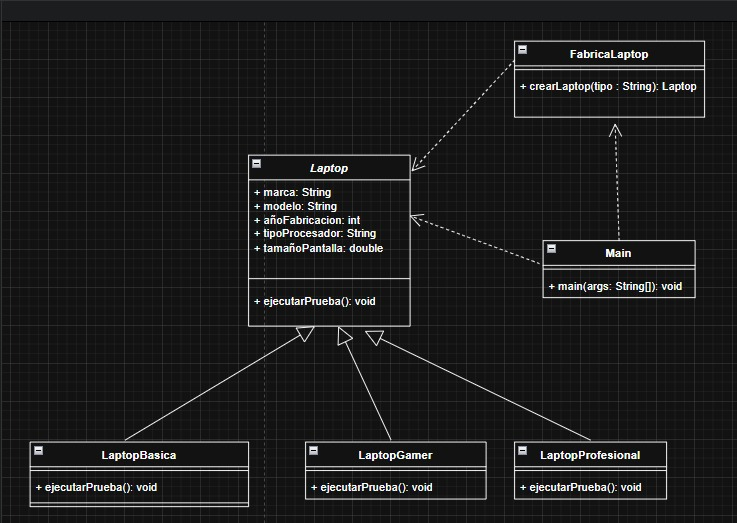

# Práctica 012: Diseño de Patrones de Software - Simple Factory

Este proyecto implementa la solución al requerimiento de fabricación y simulación de pruebas de rendimiento para modelos de laptops utilizando el patrón **Simple Factory** (Factoría Simple) en Java.

##  Diagrama de Clases UML

A continuación se presenta el diseño estructural del diagrama de clases en conformidad con la solución:

## 👤 Autor
* Diego Lezama